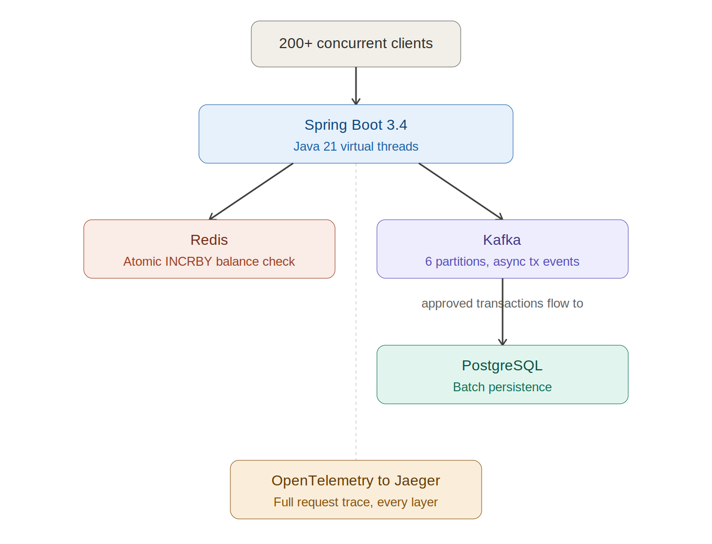

# SurgeFlow

**A race-condition-free, high-concurrency transactional ledger.** Built to survive the IRCTC-Tatkal problem: thousands of simultaneous requests against the same balance, with zero double-debits and zero corrupted state.

[Live API](http://20.196.222.20:8080/api/v1/health) · [Distributed Tracing](http://20.196.222.20:16686) · [Load Test Results](./load-tests/load-test-results.txt) · [Unit Test Results](./load-tests/unit-test-results.txt)

---

## The problem

Two simultaneous debit requests against the same ₹1,000 account, naively implemented: both read the balance, both see "sufficient funds," both succeed. Result: -₹200. This race condition compounds under concurrency at 200 simultaneous users, the failure window opens hundreds of times per second. Row-level database locking fixes correctness but kills throughput under load.

SurgeFlow solves both problems at once with a three-layer architecture: Java 21 Virtual Threads for ingestion, Redis atomic operations for race-free balance validation, and Kafka for async, non-blocking persistence.

## Architecture



Redis serializes concurrent balance mutations at the engine level — no application-side locking. Once approved, the transaction is published to Kafka and the API returns immediately; a background consumer batch-writes to PostgreSQL, decoupling customer-facing latency from disk I/O.

## Verified performance

Measured with k6 against the live production deployment (Azure B2as v2, 2 vCPU, 8GB RAM) - 200 virtual users ramping over 3 minutes. Raw output: [`load-tests/load-test-results.txt`](./load-tests/load-test-results.txt).

| Metric | Result |
|---|---|
| Requests per second | **749 RPS** |
| P95 latency | **97.19 ms** |
| P90 latency | 69.27 ms |
| Average latency | 26.04 ms |
| Error rate | **0.00%** |
| Total requests | 134,857 |
| Checks passed | 100% (94,452 / 94,452) |

Unit tests: 4/4 passing (JUnit 5 + Mockito) - [`load-tests/unit-test-results.txt`](./load-tests/unit-test-results.txt).

## Tech stack

| Layer | Technology |
|---|---|
| Runtime | Java 21 — Virtual Threads (Project Loom) |
| Framework | Spring Boot 3.4 |
| Atomic cache | Redis 7.2 (AOF persistence enabled) |
| Event streaming | Apache Kafka 7.5 (6 partitions) |
| Durable storage | PostgreSQL 16 |
| Observability | OpenTelemetry + Jaeger |
| Load testing | k6 |
| Infrastructure | Docker Compose, Azure |

## API

| Endpoint | Method | Description |
|---|---|---|
| `/api/v1/health` | GET | System health |
| `/api/v1/transactions` | POST | Process debit/credit |
| `/api/v1/accounts/{id}/balance` | GET | Sub-ms Redis balance read |
| `/api/v1/accounts/{id}/seed` | POST | Seed an account for testing |

## Run it locally

```bash
git clone https://github.com/Janani0734/surgeflow.git
cd surgeflow
docker compose up -d
mvn spring-boot:run -Dspring-boot.run.jvmArguments="-Duser.timezone=UTC"
```

```bash
# run the load test yourself
k6 run load-tests/surgeflow-load-test.js
```

## Known limitations and what I'd fix at scale

This is a single-node demo deployment by design - the goal was proving the architecture under real concurrency, not provisioning production capacity.

**Current known limitations:**
- No authentication on endpoints - acceptable for a demo, not for production
- Account must be explicitly seeded before transactions; unknown accounts are rejected
- Kafka publish failures trigger a Redis compensation rollback but no dead-letter queue for retry
- Single Redis instance - no clustering or replication

**At larger scale:**
- Horizontally scale the Spring Boot layer behind a load balancer (stateless by design, so no rearchitecting needed)
- Move to a managed multi-broker Kafka cluster (Confluent Cloud or MSK)
- Shard Redis past single-instance capacity using Redis Cluster
- Add JWT authentication and a proper account creation flow
- Introduce a dead-letter topic for failed Kafka events with a retry consumer

The core design holds at scale - atomic Redis ops, async Kafka writes, and a stateless API layer all scale by adding nodes, not by rearchitecting.

---

Built by [Janani R](https://github.com/Janani0734)
